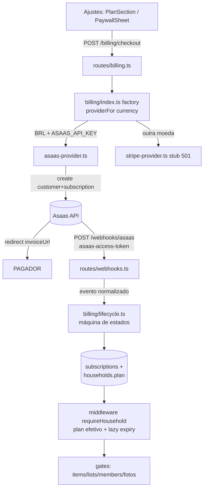

# Pro Plan + Multi-Gateway Billing — Design

**Spec**: `.specs/features/pro-plan-billing/spec.md`
**Status**: Draft (aguardando aprovação)
**Base do scout**: workflow 5 agentes (api-gates, client-paywall, schema-patterns, offline-sync, asaas-api) — file:line citados abaixo vêm daí.

---

## Abordagens consideradas (Large → exploração obrigatória)

| | Abordagem | Trade-off |
|---|---|---|
| **A (recomendada)** | **Asaas Subscriptions API**: POST `/v3/customers` + POST `/v3/subscriptions` (billingType `UNDEFINED` → cliente escolhe Pix/cartão na fatura) → redirect pra `invoiceUrl` da 1ª cobrança | ✅ `sub_...` existe ANTES do pagamento → correlação determinística via `externalReference=householdId` + externalId salvo. ✅ fluxo documentado. ❌ exige coletar **CPF/CNPJ** no nosso checkout (POST customers obriga) |
| B | Asaas Checkout hosted (`/v3/checkouts`, chargeTypes RECURRENT) | ✅ página bonita, Asaas coleta dados do pagador (sem CPF no nosso app). ❌ assinatura só nasce APÓS pagamento → correlação via callback/evento menos documentada; sessão expira; mais estados |
| C | Stripe-first | ❌ Pix invite-only pra empresa BR; mata o método #1 do mercado primário. Descartada |

**Escolha: A.** Pedir CPF é norma em assinatura BR; correlação determinística vale mais que UX marginal. B fica anotada como evolução de UX.

---

## Architecture Overview



**Fonte da verdade = nosso banco.** Provedores só empurram webhooks que convergem pra `subscriptions`; app pergunta "é Pro?" apenas ao banco. `households.plan` segue materializado (middleware/membershipOf já leem — zero mudança nos consumidores); transições de billing o atualizam.

**Inversão de dependência (pedido explícito):** espelha `email/index.ts` — porta + factory (único lugar que conhece providers concretos) + `setBillingProvider()` pra testes. Gateway novo = 1 adapter + 1 case.

---

## Code Reuse Analysis

| Existente | Local | Uso |
|---|---|---|
| Padrão porta/factory/env-gate | `apps/api/src/email/index.ts` | Copiar estrutura (factory, setProvider p/ testes) |
| Webhook handler fino + verificação + lib de efeito | `apps/api/src/routes/webhooks.ts` (Resend) + `lib/email-suppression.ts` | Mesmo shape: verifica token → parseia → delega a `billing/lifecycle.ts` → `{ok:true}` |
| Gate de item já escrito | `apps/api/src/routes/catalog.ts:215-220` (`item_limit_reached` 403, hoje no-op) | Reativar `maxItems` em shared liga sozinho |
| Plan no contexto da request | `middleware/household.ts:57` (`c.get('plan')`) | Todos os gates de rota usam |
| Constantes/regras compartilhadas | `packages/shared/src/plans.ts` | Adicionar FREE_MAX_LISTS/MEMBERS, PLAN_PRICES, applyFreeCaps() |
| Erro `{error: código}` + i18n `errors.*` | padrão da API; `errors.item_limit_reached` já existe nos 6 locales | Novos códigos: `list_limit_reached`, `member_limit_reached`, `pro_required`, `already_subscribed`, `provider_unavailable`, `provider_error` |
| Harness pglite | `apps/api/src/test/db-integration.test.ts` | Testes de lifecycle/gates (add tabelas novas no TRUNCATE) |
| CTA "Seja Pro" desabilitado | `ajustes-page.tsx:251-272` | Vira PlanSection real |
| uuidv7 time-ordered | ids de todas as linhas | **Regra de visibilidade no downgrade: `id asc` = ordem de criação** (sem coluna nova) |

---

## Components

### 1. `packages/shared/src/plans.ts` (estende)
- `FREE_MAX_ITEMS=30` (existe) · `FREE_MAX_LISTS=2` · `FREE_MAX_MEMBERS=2` · `FREE_HISTORY_DAYS=90` (existe)
- `maxItems/maxLists/maxMembers(plan)` — reativados (pro=∞)
- `PLAN_PRICES: {BRL:{monthly:1290, yearly:9900}, USD:{monthly:399, yearly:2900}}` (minor units nossos; adapter converte)
- `applyFreeCaps<T extends {id:string}>(rows, cap, plan)` — pure: pro→tudo; free→sort id asc, slice(cap). Usada client (filtro de leitura) e testável.

### 2. `apps/api/src/billing/` (novo módulo — a porta)
- `types.ts`: `PaymentProvider { name; createSubscription(p): Promise<{externalId, externalCustomerId, checkoutUrl}>; cancelSubscription(externalId): Promise<void>; verifyAndParseWebhook(req): Promise<BillingEvent|null> }`; `BillingEvent = {eventId, type: 'payment_confirmed'|'payment_overdue'|'payment_refunded'|'chargeback'|'subscription_deleted', externalSubscriptionId, raw}`
- `asaas-provider.ts`: fetch com headers `access_token` + `User-Agent` (obrigatório); base URL por `ASAAS_BASE_URL` (default sandbox `https://api-sandbox.asaas.com/v3`); `value` em **reais decimais** (converte de cents: `priceCents/100`); cycle map monthly→MONTHLY, yearly→YEARLY; billingType `UNDEFINED`; checkoutUrl = `invoiceUrl` da 1ª cobrança (GET `/subscriptions/{id}/payments`); mapeia eventos: PAYMENT_CONFIRMED|RECEIVED→payment_confirmed, PAYMENT_OVERDUE→payment_overdue, PAYMENT_REFUNDED→payment_refunded, PAYMENT_CHARGEBACK_*→chargeback, SUBSCRIPTION_DELETED|INACTIVATED→subscription_deleted; webhook auth: header `asaas-access-token` === `ASAAS_WEBHOOK_TOKEN`
- `stripe-provider.ts`: stub — todo método lança `provider_unavailable` (rota → 501)
- `index.ts`: factory `billingProviderFor(currency)`: BRL→asaas (se `ASAAS_API_KEY`, senão null→501), senão→stripe (se `STRIPE_SECRET_KEY`, senão null→501); `setBillingProvider()` p/ testes
- `lifecycle.ts`: **lib de efeito (todo o estado muda aqui; testada no pglite)**
  - `applyBillingEvent(evt)`: idempotência (insert `webhook_events` unique(provider,eventId) — conflito=no-op); localiza subscription por externalId; aplica máquina de estados; sincroniza `households.plan`
  - `resolveEffectivePlan(householdId)`: lazy expiry — `canceled` com `currentPeriodEnd<now` OU `overdue` com `overdueSince+7d<now` → flip plan free (write-behind); `planOverride` sempre vence. Chamada em membershipOf (barata: só quando há subscription não-terminal)
  - Máquina: `pending→active` (payment_confirmed) · `active→overdue` (payment_overdue) · `overdue→active` (payment_confirmed) · `*→canceled` (subscription_deleted | refund | chargeback | lazy) · canceled/terminal ignora tudo (guarda contra out-of-order)

### 3. Schema (migração 0026) — server-authoritative, sem colunas sync
```ts
subscriptions: { id uuid pk (uuidv7 app), householdId uuid fk cascade, provider text enum['asaas','stripe'],
  externalId text, externalCustomerId text, status text enum['pending','active','overdue','canceled'],
  cycle text enum['monthly','yearly'], currency text, priceCents integer,
  nextDueDate tsz?, currentPeriodEnd tsz?, overdueSince tsz?, canceledAt tsz?,
  createdAt/updatedAt tsz defaultNow }
// unique index parcial: 1 não-terminal por casa
uniqueIndex('subs_active_household').on(householdId).where(status != 'canceled')
webhook_events: { id uuid pk, provider text, eventId text, type text, receivedAt tsz defaultNow }
// unique(provider, eventId) → idempotência
households: + planOverride text enum['pro'] null  // comp/100%: setável via SQL; efetivo = override ?? plan
```
CPF/CNPJ **não é persistido** (LGPD): vai direto pro Asaas; guardamos só `externalCustomerId`.

### 4. `apps/api/src/routes/billing.ts` (novo) + gates em rotas existentes
- `POST /billing/checkout {cycle, cpfCnpj}` — requireHousehold; role owner|admin (403); moeda = household.currency; provider null→501 `provider_unavailable`; subscription não-terminal existente→409 `already_subscribed` (exceto `pending`>24h: cancela e recria); cria linha `pending` + retorna `{checkoutUrl}`; erro provider→502 `provider_error`
- `GET /billing/subscription` — `{status,cycle,currency,priceCents,nextDueDate,provider} | null`
- `POST /billing/cancel` — owner|admin; DELETE no provider (best-effort); status `canceled`, `currentPeriodEnd=nextDueDate` (Pro até o fim do pago; lazy flip depois)
- `POST /webhooks/asaas` — fora de auth (como Resend); token→401; evento não parseado→400; `applyBillingEvent`; sempre log `{event, externalId, resultado}`
- Gates: `catalog.ts` (existente, liga via shared) · `shopping.ts` POST /lists (novo, count `deletedAt IS NULL` → `list_limit_reached`) · `households.ts /join` (**dentro da transação** existente linhas 403-411: busca plan do `invite.householdId` + count → `member_limit_reached`; checagem antecipada nos 2 creates de convite via `membership.plan` p/ UX) · `uploads.ts` presign (`pro_required` 403 após o check 501) · exclusão de household (LGPD): cancel provider best-effort

### 5. Client (`apps/web`)
- **Plan em `db.meta`** (persistido no fetch de membership) — preflight offline; desconhecido→fail-open (servidor é autoritativo)
- **Preflight nos repositories** (`createItem` repositories.ts:46, `createList` :384): count Dexie (índice householdId existe) >= cap → throw `Error('item_limit_reached'|'list_limit_reached')` ANTES do put otimista; form traduz via `errors.*` + CTA upgrade
- **Reconciliação 4xx no drainOutbox** (engine.ts:171 — hoje delete silencioso): para códigos `*_limit_reached`/`pro_required` em POST: deleta linha otimista local via `entry.rowId` (item+barcodes) e incrementa contador `db.meta['rejectedByPlan']` → banner "alteração rejeitada: limite do plano". Resolve o órfão documentado no STATE.md:44 pros casos de plano
- **Filtro de leitura + aviso (refinamento do user):** `applyFreeCaps` nas superfícies de catálogo (itens-page, dashboard, listas-page) + `historyCutoff` já existente; hook `useHiddenCounts()` (total local − visível) alimenta **banner persistente "N itens/listas ocultos — o Pro revela"** com CTA → Ajustes/plano. Corrigir inconsistência: `check-item-sheet.tsx:50-58` sem `historyCutoff` (aplicar)
- **Gate de fotos na captura** (item-form-page.tsx:199, compra-page.tsx:724): free→PaywallSheet em vez do file picker (evita o loop silencioso do sweep: uploads.ts só trata 501; sweep engine.ts:210-224 trataria 403 como skip)
- **Gates client-only**: analytics-page (upsell full-page se free) + botão print; exportPricesCsv (backup.ts:19) → PaywallSheet. Export JSON LGPD (`/me/export`) **permanece free**
- **PlanSection em Ajustes** (substitui CTA morto :251-272): free→comparativo+preços+CPF+mensal/anual→redirect `checkoutUrl`; pro→status/próxima cobrança/cancelar(confirm). Retorno do checkout: focus-refetch (já existe tick no focus) + invalidate `['membership']`
- **PaywallSheet** reutilizável (gro-sheet-*) usado por todos os gates
- i18n: novas chaves `billing.*`/`errors.*` nos **6 locales**

---

## Error Handling Strategy

| Cenário | Tratamento | Usuário vê |
|---|---|---|
| Env Asaas ausente | 501 `provider_unavailable` | "Assinatura indisponível no momento" |
| Moeda ≠ BRL (Stripe stub) | 501 `provider_unavailable` | idem + nota "em breve na sua moeda" |
| Asaas fora do ar no checkout | 502 `provider_error` | erro inline + tentar de novo |
| Webhook token inválido | 401, sem efeito | — |
| Evento duplicado | no-op (unique) | — |
| Evento out-of-order | máquina ignora transição inválida (log) | — |
| Free estoura teto online | 403 código tipado | erro traduzido + CTA Pro |
| Free estoura teto offline | preflight bloqueia; se escapou: 403 no sync→remove otimista+banner | aviso "rejeitado: limite do plano" |
| Checkout abandonado | `pending`; novo checkout >24h cancela e recria | novo link normal |

---

## Risks & Concerns

| Concern | Local | Impacto | Mitigação |
|---|---|---|---|
| count+insert sem lock (race no teto) | catalog.ts:215-219 (e novos gates) | 2 POSTs simultâneos estouram teto em +1 | Aceito (escala casa 2-4; teto é soft-business); /join único que exige atomicidade e JÁ roda em transação com FOR UPDATE |
| 4xx dependente sem mapeamento FK→4xx | inventory/movements/prices/sessions | item rejeitado por limite → FK 500 → 5 retries → dead-letter poluído | Replicar mapeamento `entry_ref_missing` (shopping.ts:167) nas rotas dependentes — task própria |
| `value` Asaas em reais decimais | asaas-provider | erro de conversão = cobrar 100x | `priceCents/100` com teste unitário explícito; BRL sempre 2 casas |
| uploadBlob engole não-501 | lib/uploads.ts:34,63 + sweep engine.ts:210 | foto de free tentaria subir pra sempre | Gate na captura (primário) + sweep pula quando plan=free |
| Histórico/analytics/CSV são gates client-only | sync entrega tudo (offline-first) | free "hackeável" via devtools | Aceito e documentado: gates de leitura são soft (dados já são do usuário); gates de escrita são hard no servidor |
| Fila webhook Asaas interrompe após 15 falhas | infra | eventos param (retidos 14d) | Handler nunca lança (try/catch→200 com log de erro interno); alarme = log |
| `paymentCreationMode=SUBSCRIPTION` do Pix Automático ambíguo nas docs | asaas | — | **Fora do MVP**: Pix Automático exige PJ 6+ meses; MVP usa assinatura normal (billingType UNDEFINED — Pix manual por ciclo + cartão automático). Pix Automático = evolução futura do adapter |

---

## Tech Decisions (não-óbvias)

| Decisão | Escolha | Rationale |
|---|---|---|
| Checkout | invoiceUrl da assinatura (abordagem A) | correlação determinística; sub_ existe antes do pagamento |
| CPF/CNPJ | coletado no checkout, enviado ao Asaas, **não persistido** | obrigatório na API; LGPD-friendly |
| Plan efetivo | `planOverride ?? households.plan` materializado + lazy expiry em membershipOf | zero cron; consumidores existentes intactos |
| Ordem de visibilidade no downgrade | `id asc` (uuidv7 é time-ordered) | ordem de criação sem coluna nova |
| Pix Automático | fora do MVP | exige PJ 6+ meses; UNDEFINED cobre Pix por ciclo |
| Provider travado na assinatura | coluna `provider` na linha | mudança de moeda não re-roteia assinatura ativa |
| **Supersede STATE.md 2026-06-13** | billing = **Asaas (BR) + Stripe stub**, não mais Mercado Pago | decisão do usuário nesta feature (registrar no STATE.md ao fechar) |

---

## Unresolved questions
1. Cancelamento Asaas: DELETE remove cobranças pendentes — confirmar em sandbox que não gera evento que a máquina interprete errado (SUBSCRIPTION_DELETED esperado).
2. `pending` >24h: cancela-e-recria assume DELETE idempotente em sub sem pagamento — validar sandbox.
