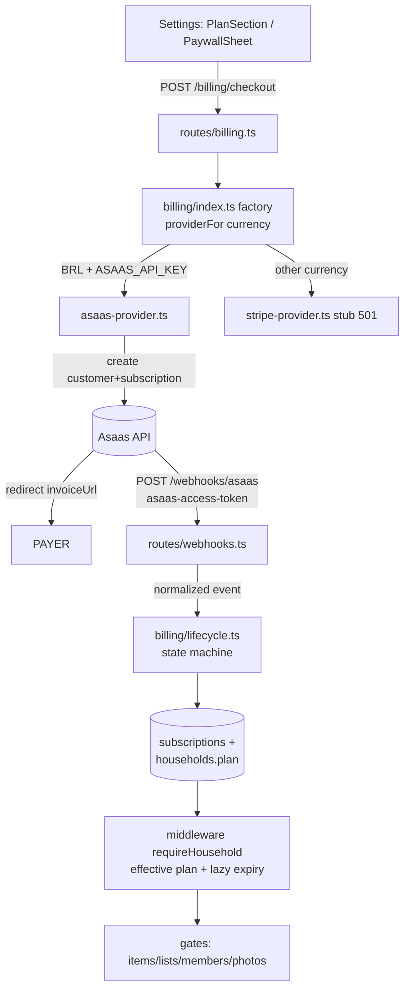

# Pro Plan + Multi-Gateway Billing — Design

**Spec**: `.specs/features/pro-plan-billing/spec.md`
**Status**: Draft (awaiting approval)
**Scout base**: 5-agent workflow (api-gates, client-paywall, schema-patterns, offline-sync, asaas-api) — the file:line citations below come from it.

---

## Approaches considered (Large → mandatory exploration)

| | Approach | Trade-off |
|---|---|---|
| **A (recommended)** | **Asaas Subscriptions API**: POST `/v3/customers` + POST `/v3/subscriptions` (billingType `UNDEFINED` → customer picks Pix/card on the invoice) → redirect to the `invoiceUrl` of the 1st charge | ✅ `sub_...` exists BEFORE payment → deterministic correlation via `externalReference=householdId` + saved externalId. ✅ documented flow. ❌ requires collecting **CPF/CNPJ** in our checkout (POST customers requires it) |
| B | Asaas hosted Checkout (`/v3/checkouts`, chargeTypes RECURRENT) | ✅ nice page, Asaas collects the payer's data (no CPF in our app). ❌ the subscription is only born AFTER payment → correlation via callback/event is less documented; the session expires; more states |
| C | Stripe-first | ❌ Pix is invite-only for BR companies; kills the #1 method of the primary market. Discarded |

**Choice: A.** Asking for CPF is the norm in BR subscriptions; deterministic correlation is worth more than marginal UX. B is noted as a UX evolution.

---

## Architecture Overview



**Source of truth = our database.** Providers only push webhooks that converge into `subscriptions`; the app asks "is it Pro?" only of the database. `households.plan` stays materialized (middleware/membershipOf already read it — zero change to consumers); billing transitions update it.

**Dependency inversion (explicit request):** mirrors `email/index.ts` — port + factory (the single place that knows the concrete providers) + `setBillingProvider()` for tests. A new gateway = 1 adapter + 1 case.

---

## Code Reuse Analysis

| Existing | Location | Use |
|---|---|---|
| Port/factory/env-gate pattern | `apps/api/src/email/index.ts` | Copy the structure (factory, setProvider for tests) |
| Thin webhook handler + verification + effect lib | `apps/api/src/routes/webhooks.ts` (Resend) + `lib/email-suppression.ts` | Same shape: verify token → parse → delegate to `billing/lifecycle.ts` → `{ok:true}` |
| Item gate already written | `apps/api/src/routes/catalog.ts:215-220` (`item_limit_reached` 403, currently no-op) | Reactivating `maxItems` in shared wires it up on its own |
| Plan in the request context | `middleware/household.ts:57` (`c.get('plan')`) | All route gates use it |
| Shared constants/rules | `packages/shared/src/plans.ts` | Add FREE_MAX_LISTS/MEMBERS, PLAN_PRICES, applyFreeCaps() |
| `{error: code}` error + i18n `errors.*` | API standard; `errors.item_limit_reached` already exists in the 6 locales | New codes: `list_limit_reached`, `member_limit_reached`, `pro_required`, `already_subscribed`, `provider_unavailable`, `provider_error` |
| pglite harness | `apps/api/src/test/db-integration.test.ts` | Lifecycle/gate tests (add the new tables to the TRUNCATE) |
| Disabled "Go Pro" CTA | `ajustes-page.tsx:251-272` | Becomes a real PlanSection |
| uuidv7 time-ordered | ids of all rows | **Downgrade visibility rule: `id asc` = creation order** (no new column) |

---

## Components

### 1. `packages/shared/src/plans.ts` (extends)
- `FREE_MAX_ITEMS=30` (exists) · `FREE_MAX_LISTS=2` · `FREE_MAX_MEMBERS=2` · `FREE_HISTORY_DAYS=90` (exists)
- `maxItems/maxLists/maxMembers(plan)` — reactivated (pro=∞)
- `PLAN_PRICES: {BRL:{monthly:1290, yearly:9900}, USD:{monthly:399, yearly:2900}}` (our minor units; adapter converts)
- `applyFreeCaps<T extends {id:string}>(rows, cap, plan)` — pure: pro→everything; free→sort id asc, slice(cap). Used by the client (read filter) and testable.

### 2. `apps/api/src/billing/` (new module — the port)
- `types.ts`: `PaymentProvider { name; createSubscription(p): Promise<{externalId, externalCustomerId, checkoutUrl}>; cancelSubscription(externalId): Promise<void>; verifyAndParseWebhook(req): Promise<BillingEvent|null> }`; `BillingEvent = {eventId, type: 'payment_confirmed'|'payment_overdue'|'payment_refunded'|'chargeback'|'subscription_deleted', externalSubscriptionId, raw}`
- `asaas-provider.ts`: fetch with headers `access_token` + `User-Agent` (required); base URL via `ASAAS_BASE_URL` (default sandbox `https://api-sandbox.asaas.com/v3`); `value` in **decimal reais** (converts from minor units: `priceCents/100`); cycle map monthly→MONTHLY, yearly→YEARLY; billingType `UNDEFINED`; checkoutUrl = `invoiceUrl` of the 1st charge (GET `/subscriptions/{id}/payments`); maps events: PAYMENT_CONFIRMED|RECEIVED→payment_confirmed, PAYMENT_OVERDUE→payment_overdue, PAYMENT_REFUNDED→payment_refunded, PAYMENT_CHARGEBACK_*→chargeback, SUBSCRIPTION_DELETED|INACTIVATED→subscription_deleted; webhook auth: header `asaas-access-token` === `ASAAS_WEBHOOK_TOKEN`
- `stripe-provider.ts`: stub — every method throws `provider_unavailable` (route → 501)
- `index.ts`: factory `billingProviderFor(currency)`: BRL→asaas (if `ASAAS_API_KEY`, otherwise null→501), otherwise→stripe (if `STRIPE_SECRET_KEY`, otherwise null→501); `setBillingProvider()` for tests
- `lifecycle.ts`: **effect lib (all state changes here; tested in pglite)**
  - `applyBillingEvent(evt)`: idempotency (insert `webhook_events` unique(provider,eventId) — conflict=no-op); locates the subscription by externalId; applies the state machine; syncs `households.plan`
  - `resolveEffectivePlan(householdId)`: lazy expiry — `canceled` with `currentPeriodEnd<now` OR `overdue` with `overdueSince+7d<now` → flip plan to free (write-behind); `planOverride` always wins. Called in membershipOf (cheap: only when there is a non-terminal subscription)
  - Machine: `pending→active` (payment_confirmed) · `active→overdue` (payment_overdue) · `overdue→active` (payment_confirmed) · `*→canceled` (subscription_deleted | refund | chargeback | lazy) · canceled/terminal ignores everything (guards against out-of-order)

### 3. Schema (migration 0026) — server-authoritative, no sync columns
```ts
subscriptions: { id uuid pk (uuidv7 app), householdId uuid fk cascade, provider text enum['asaas','stripe'],
  externalId text, externalCustomerId text, status text enum['pending','active','overdue','canceled'],
  cycle text enum['monthly','yearly'], currency text, priceCents integer,
  nextDueDate tsz?, currentPeriodEnd tsz?, overdueSince tsz?, canceledAt tsz?,
  createdAt/updatedAt tsz defaultNow }
// partial unique index: 1 non-terminal per household
uniqueIndex('subs_active_household').on(householdId).where(status != 'canceled')
webhook_events: { id uuid pk, provider text, eventId text, type text, receivedAt tsz defaultNow }
// unique(provider, eventId) → idempotência
households: + planOverride text enum['pro'] null  // comp/100%: settable via SQL; effective = override ?? plan
```
CPF/CNPJ is **not persisted** (LGPD): it goes straight to Asaas; we store only `externalCustomerId`.

### 4. `apps/api/src/routes/billing.ts` (new) + gates in existing routes
- `POST /billing/checkout {cycle, cpfCnpj}` — requireHousehold; role owner|admin (403); currency = household.currency; provider null→501 `provider_unavailable`; existing non-terminal subscription→409 `already_subscribed` (except `pending`>24h: cancel and recreate); creates a `pending` row + returns `{checkoutUrl}`; provider error→502 `provider_error`
- `GET /billing/subscription` — `{status,cycle,currency,priceCents,nextDueDate,provider} | null`
- `POST /billing/cancel` — owner|admin; DELETE at the provider (best-effort); status `canceled`, `currentPeriodEnd=nextDueDate` (Pro until the end of the paid period; lazy flip afterward)
- `POST /webhooks/asaas` — outside auth (like Resend); token→401; unparsed event→400; `applyBillingEvent`; always log `{event, externalId, result}`
- Gates: `catalog.ts` (existing, wires via shared) · `shopping.ts` POST /lists (new, count `deletedAt IS NULL` → `list_limit_reached`) · `households.ts /join` (**inside the transaction** at existing lines 403-411: fetches the plan of `invite.householdId` + count → `member_limit_reached`; early check in the 2 invite creates via `membership.plan` for UX) · `uploads.ts` presign (`pro_required` 403 after the 501 check) · household deletion (LGPD): best-effort provider cancel

### 5. Client (`apps/web`)
- **Plan in `db.meta`** (persisted on the membership fetch) — offline preflight; unknown→fail-open (the server is authoritative)
- **Preflight in the repositories** (`createItem` repositories.ts:46, `createList` :384): Dexie count (householdId index exists) >= cap → throw `Error('item_limit_reached'|'list_limit_reached')` BEFORE the optimistic put; the form translates via `errors.*` + upgrade CTA
- **4xx reconciliation in drainOutbox** (engine.ts:171 — currently a silent delete): for codes `*_limit_reached`/`pro_required` on POST: deletes the local optimistic row via `entry.rowId` (item+barcodes) and increments the `db.meta['rejectedByPlan']` counter → banner "change rejected: plan limit". Resolves the orphan documented in STATE.md:44 for the plan cases
- **Read filter + warning (user refinement):** `applyFreeCaps` on the catalog surfaces (itens-page, dashboard, listas-page) + the existing `historyCutoff`; the `useHiddenCounts()` hook (local total − visible) feeds a **persistent banner "N items/lists hidden — Pro reveals them"** with a CTA → Settings/plan. Fix inconsistency: `check-item-sheet.tsx:50-58` lacks `historyCutoff` (apply it)
- **Photo gate at capture** (item-form-page.tsx:199, compra-page.tsx:724): free→PaywallSheet instead of the file picker (avoids the silent sweep loop: uploads.ts only handles 501; sweep engine.ts:210-224 would treat 403 as skip)
- **Client-only gates**: analytics-page (full-page upsell if free) + print button; exportPricesCsv (backup.ts:19) → PaywallSheet. LGPD JSON export (`/me/export`) **stays free**
- **PlanSection in Settings** (replaces the dead CTA :251-272): free→comparison+prices+CPF+monthly/yearly→redirect `checkoutUrl`; pro→status/next charge/cancel(confirm). Return from checkout: focus-refetch (a focus tick already exists) + invalidate `['membership']`
- **PaywallSheet** reusable (gro-sheet-*) used by all the gates
- i18n: new `billing.*`/`errors.*` keys in the **6 locales**

---

## Error Handling Strategy

| Scenario | Handling | User sees |
|---|---|---|
| Asaas env absent | 501 `provider_unavailable` | "Subscription unavailable right now" |
| Currency ≠ BRL (Stripe stub) | 501 `provider_unavailable` | same + note "coming soon in your currency" |
| Asaas down at checkout | 502 `provider_error` | inline error + try again |
| Invalid webhook token | 401, no effect | — |
| Duplicate event | no-op (unique) | — |
| Out-of-order event | machine ignores the invalid transition (log) | — |
| Free exceeds cap online | 403 typed code | translated error + Pro CTA |
| Free exceeds cap offline | preflight blocks; if it slipped through: 403 on sync→removes optimistic+banner | warning "rejected: plan limit" |
| Abandoned checkout | `pending`; a new checkout >24h cancels and recreates | normal new link |

---

## Risks & Concerns

| Concern | Location | Impact | Mitigation |
|---|---|---|---|
| count+insert without a lock (race on the cap) | catalog.ts:215-219 (and new gates) | 2 simultaneous POSTs exceed the cap by +1 | Accepted (household scale 2-4; the cap is soft-business); /join is the only one requiring atomicity and ALREADY runs in a transaction with FOR UPDATE |
| Dependent 4xx without FK→4xx mapping | inventory/movements/prices/sessions | item rejected by limit → FK 500 → 5 retries → polluted dead-letter | Replicate the `entry_ref_missing` mapping (shopping.ts:167) in the dependent routes — its own task |
| Asaas `value` in decimal reais | asaas-provider | conversion error = charge 100x | `priceCents/100` with an explicit unit test; BRL always 2 decimals |
| uploadBlob swallows non-501 | lib/uploads.ts:34,63 + sweep engine.ts:210 | a free photo would try to upload forever | Gate at capture (primary) + sweep skips when plan=free |
| History/analytics/CSV are client-only gates | sync delivers everything (offline-first) | free "hackable" via devtools | Accepted and documented: read gates are soft (the data is already the user's); write gates are hard on the server |
| Asaas webhook queue interrupts after 15 failures | infra | events stop (retained 14d) | Handler never throws (try/catch→200 with an internal error log); the alarm = the log |
| Pix Automático's `paymentCreationMode=SUBSCRIPTION` ambiguous in the docs | asaas | — | **Out of the MVP**: Pix Automático requires a PJ 6+ months old; the MVP uses a normal subscription (billingType UNDEFINED — manual Pix per cycle + automatic card). Pix Automático = future adapter evolution |

---

## Tech Decisions (non-obvious)

| Decision | Choice | Rationale |
|---|---|---|
| Checkout | the subscription's invoiceUrl (approach A) | deterministic correlation; sub_ exists before payment |
| CPF/CNPJ | collected at checkout, sent to Asaas, **not persisted** | required by the API; LGPD-friendly |
| Effective plan | `planOverride ?? households.plan` materialized + lazy expiry in membershipOf | zero cron; existing consumers intact |
| Downgrade visibility order | `id asc` (uuidv7 is time-ordered) | creation order without a new column |
| Pix Automático | out of the MVP | requires a PJ 6+ months old; UNDEFINED covers Pix per cycle |
| Provider pinned on the subscription | `provider` column on the row | a currency change does not re-route an active subscription |
| **Supersedes STATE.md 2026-06-13** | billing = **Asaas (BR) + Stripe stub**, no longer Mercado Pago | user decision in this feature (record in STATE.md at close) |

---

## Unresolved questions
1. Asaas cancellation: DELETE removes pending charges — confirm in sandbox that it does not generate an event the machine misinterprets (SUBSCRIPTION_DELETED expected).
2. `pending` >24h: cancel-and-recreate assumes an idempotent DELETE on a subscription with no payment — validate in sandbox.
